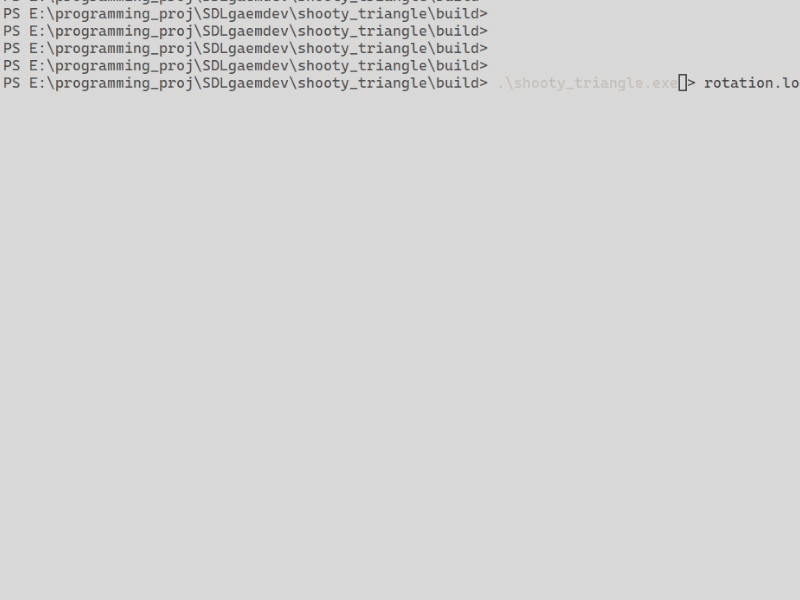

# shooty triangle

it be a triang that shoot

## Showcase 

### Version 1:

 

### Version 2:

 
Changes:
* rotating while moving

### Version 3:

 
Changes:
* fps counter
* vsync
* frame-independent movement using delta time
* window boundary check for movement

### Version 4:

 
Changes:
* shoot variations of projectiles with mouse klick

Objective: 
make projectiles shoot from the player towards mouse position, 
create hostile elements 

### Version 5:

 
Changes:
* shoot projectiles towards mouse
