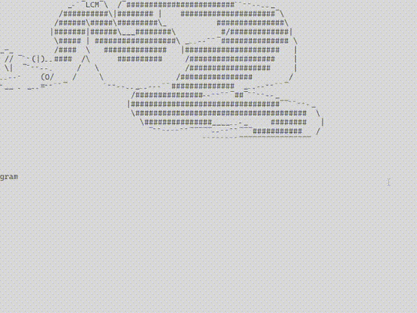

# shooty triangle

it be a triang that shoot

[![wiki][wiki_img]][wiki_link] <b>Check out [the wiki of this repo][wiki_link] if you are looking to learn from this project!</b>

## Showcase 

### Version 8:

 
Changes:
* add score counter that adds points if hit enemy, or subtracts if missed enemy
* add small randomization to enemy direction

### Version 7:

 
Changes:
* add pause and game-over menu which provides restart option

### Version 6:

 
Changes:
* add enemies that can be shot
Objective: 
make projectiles shoot from the player towards mouse position, 
create hostile elements 

### Version 5:

 
Changes:
* shoot projectiles towards mouse

### Version 4:

 
Changes:
* shoot variations of projectiles with mouse klick

### Version 3:

 
Changes:
* fps counter
* vsync
* frame-independent movement using delta time
* window boundary check for movement

### Version 2:

 
Changes:
* rotating while moving

### Version 1:

 

[wiki_img]:
https://upload.wikimedia.org/wikipedia/commons/2/2c/Tango_style_Wikipedia_Icon.svg

[wiki_link]:
https://github.com/LEMMIIX/shooty-triangle/wiki
